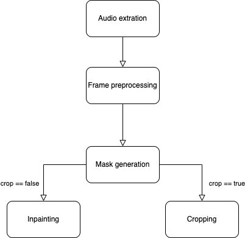
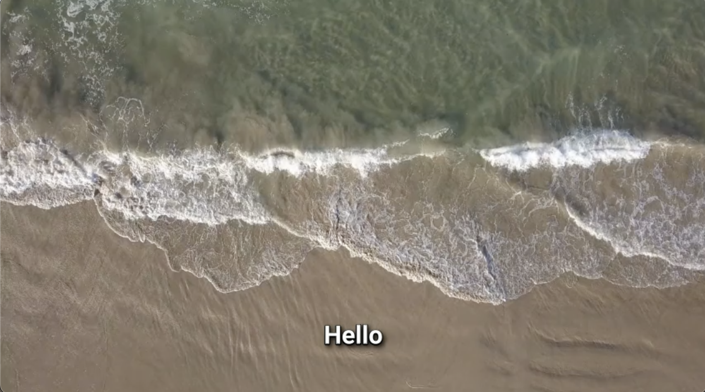
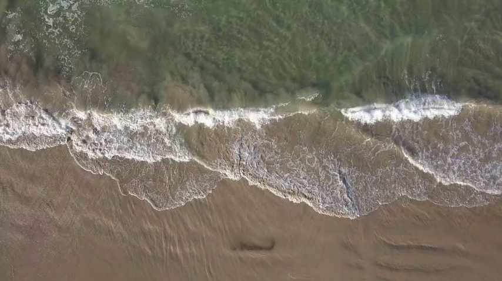
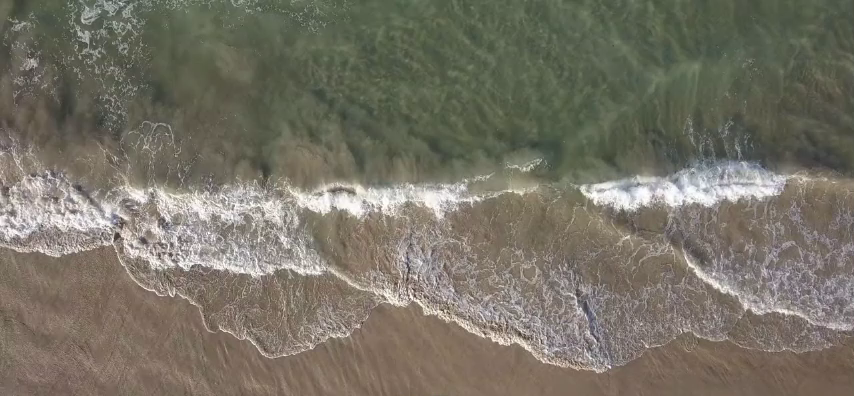

# A Subtitle Cropping & Inpainting Solution


## Descrption
Videos are a valuable resource for training deep neural networks; however, many videos, even those purchased from trusted merchants, include watermarks, logos, or subtitles that can interfere with model performance. These unwanted elements often introduce biases or artifacts, rendering the affected video segments unsuitable for use in training data. This project addresses that challenge by providing a pipeline to automatically detect and remove watermarks or subtitles,ensuring a cleaner dataset and increasing the utilization of available materials for training high-performance neural networks.

##  Pipeline

## Get Start
- Download the image_inpainting folder and dependencies. 
- Replace the ```easyocr.py``` file in the EasyOCR with the ```easyocr.py``` file from the image_inpainting folder.
- Similarly, replace ```inpaint.py``` in the latent diffusion with ```roi_inpaint.py``` from the image_inpainting folder.

## Directory Structure
```
$~/home_folder/
├── image_inpainting
│   ├── easyocr.py
│   ├── roi_inpaint.py
|   ├── ...
├── EasyOCR
|   ├── easyocr
│   |   ├── easyocr.py
|   |   ├── ...
├── latent diffusion
│   ├── scripts
│   |   ├── inpaint.py
│   |   ├── ...
├── sam2
```
## Requirement
```
torch>=2.5.1 with cuda support
python>=3.10
ffmpeg
```
and the required package by following components:
- [Segment Anything 2](https://github.com/facebookresearch/sam2)
- [EasyOCR](https://github.com/JaidedAI/EasyOCR)
- [Latent Diffusion Models](https://github.com/CompVis/latent-diffusion)

## Speed
Inpainting: 3 to 15 seconds per frame from 360P to 1080P(Tested using a single V100. Cold start time Excluded). 

## Effect
1. Original

2. Image after Inpainting

3. Image after Cropping


## Acknowledgments
- [Segment Anything 2](https://github.com/facebookresearch/sam2)
- [EasyOCR](https://github.com/JaidedAI/EasyOCR)
- [Latent Diffusion Models](https://github.com/CompVis/latent-diffusion)
